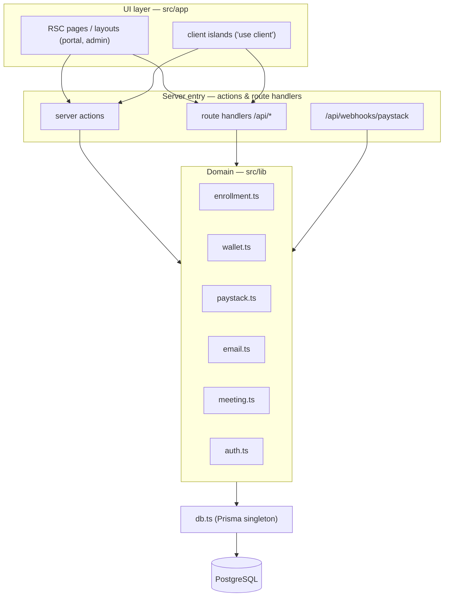
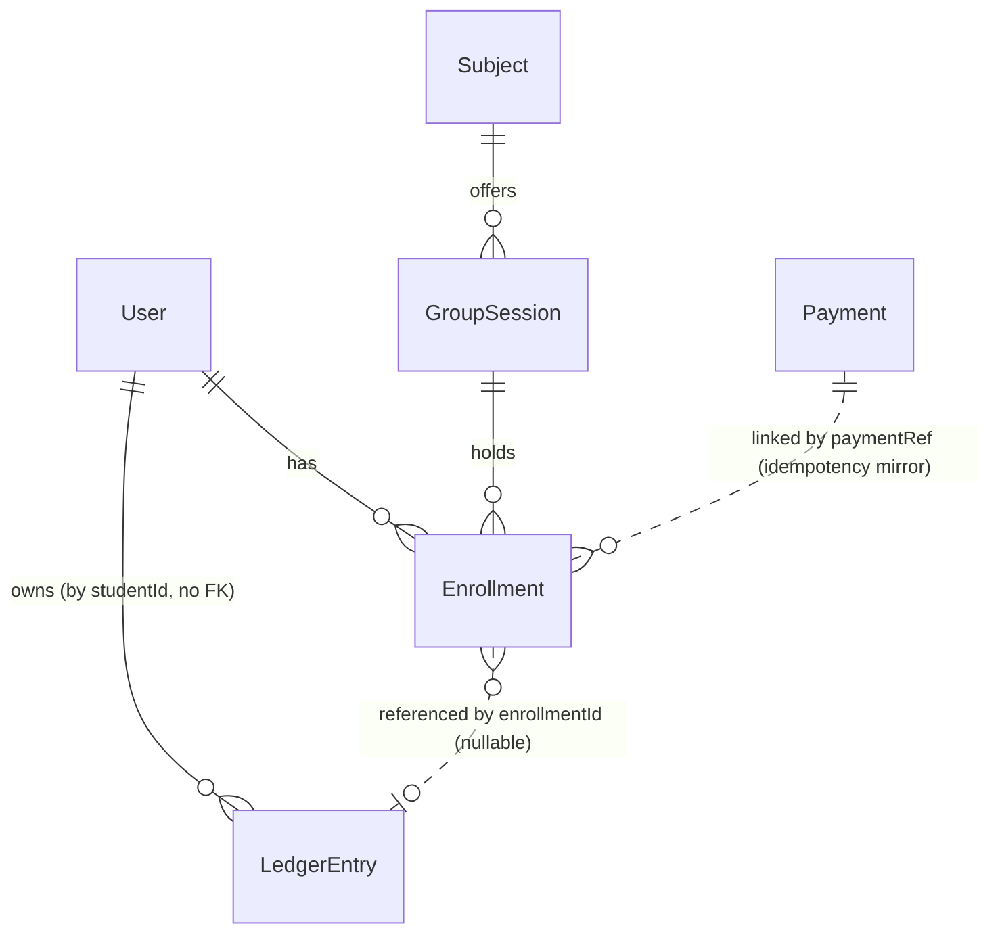
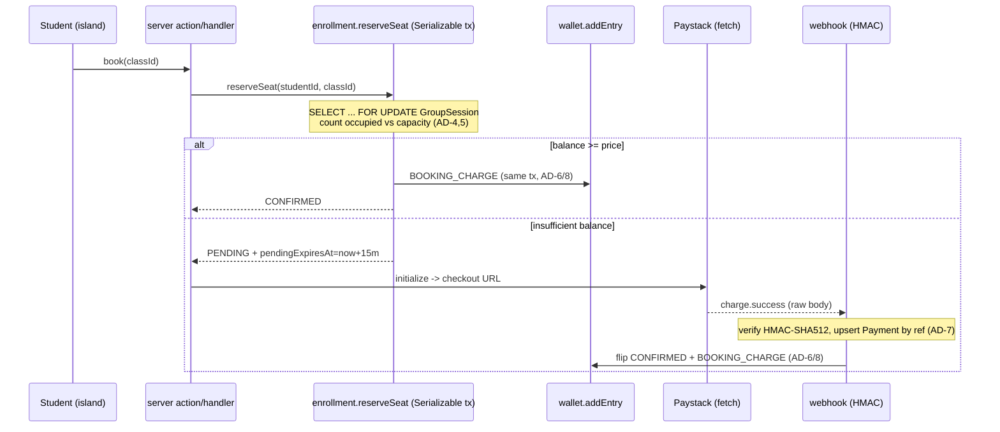

# Architecture Spine — ACCE Phase 1a (Group Classes MVP)

> Target-state architecture for the Phase 1a portal. Supersedes `docs/architecture.md` (a stale pre-rebrand *current-state* scan) for anything portal-related. Data model, `db.ts`, and auth tables tagged **[ADOPTED]** already exist in code (migration `20260705182521_init`); the rest is the contract for work not yet built.

## Design Paradigm

**Server-first layered app on Next.js App Router.** The portal is added as **additive route groups** inside the one existing app — not a new service. Strict one-way dependency: UI → server entry → domain → data.



**Rule of direction:** an arrow may only point downward. A client island never imports a domain module or `db` directly; UI never contains business logic; domain modules never import from `src/app`.

Layer → location:

| Layer | Location |
| --- | --- |
| Marketing (untouched) | `src/app/*` flat routes, `src/components/*` |
| Portal UI | `src/app/(portal)/portal/**` |
| Admin UI | `src/app/(admin)/admin/**` |
| Server entry | server actions colocated with routes; `src/app/api/**` route handlers |
| Domain | `src/lib/{enrollment,wallet,paystack,email,meeting,auth}.ts` |
| Data gateway | `src/lib/db.ts` |

## Invariants & Rules

### AD-1 — Additive route-group isolation [ADOPTED-intent]
- **Binds:** FR3, NFR8, NFR11, all portal/admin routes
- **Prevents:** portal work regressing the marketing site's routes, SEO, or headers; a second parallel deployment.
- **Rule:** Portal and admin live only under `(portal)`/`(admin)` route groups in the **same** Next app. Flat marketing routes and their metadata/`sitemap`/`robots` are not modified. Global `next.config.ts` security headers may be **extended additively** where the portal needs it (e.g. `connect-src`/`form-action` gaining the Paystack host) but existing marketing directives are never weakened or removed. The portal is reached via the `portal.accetutors.co.za` host mapping, not a separate build.

### AD-2 — Single data gateway [ADOPTED]
- **Binds:** all, NFR6
- **Prevents:** connection-pool fan-out; divergent DB clients.
- **Rule:** `src/lib/db.ts` (`PrismaClient` + `@prisma/adapter-pg` + `pg.Pool`, singleton) is the only database access point. No `new PrismaClient()` anywhere else. Already in code.

### AD-3 — Authorization is enforced at the data/entry layer, not the layout
- **Binds:** FR1, FR2, FR3, NFR11
- **Prevents:** a page or action shipped without its guard; the RSC-500 leak trap (lessons-learned).
- **Rule:** A Next.js **layout is not a security boundary** — a page can render without its ancestor layout (direct RSC request). So authorization is enforced **server-side at every data-access and mutation entry**: each server action, route handler, and shared data-fetch (DAL) function checks the session + `role` before doing work. `middleware.ts` provides a coarse redirect and the layout redirect is for UX, but neither is trusted as the guard. `role` (Better Auth admin plugin) is the single key: `(portal)` entries require a `STUDENT`+ session, `(admin)` entries require `ADMIN`. (Generalises AD-10.)

### AD-4 — One canonical seat reservation; oversell prevented by SSI
- **Binds:** FR7, FR8, FR10, FR11, NFR1
- **Prevents:** overselling; two divergent reservation implementations (balance vs Paystack).
- **Rule:** Every seat acquisition — wallet-balance path **and** Paystack path — goes through a single `reserveSeat()` in `src/lib/enrollment.ts`, in one interactive **`Serializable`** transaction. The no-oversell **guarantee comes from Serializable SSI**: the occupancy count reads child `Enrollment` rows under a snapshot a plain row lock would not refresh, so SSI (not `FOR UPDATE`) is what actually blocks the last-seat race. `SELECT … FOR UPDATE` on the `GroupSession` row is kept as belt-and-braces to serialise concurrent writers on the same class. Any isolation downgrade silently reintroduces oversell. `reserveSeat()` retries on **both** Prisma `P2034` and raw pg `40001` with bounded backoff. Verification **must** include a real-Postgres concurrency integration test (unit mocks can't exercise `40001`).

### AD-5 — Capacity is derived, never stored; readers never write
- **Binds:** FR4, FR9, FR10
- **Prevents:** drift between a denormalized seat counter and reality; a reader racing a confirm.
- **Rule:** `occupied = count(Enrollment where status ∈ {PENDING, CONFIRMED} and (pendingExpiresAt is null or pendingExpiresAt > now))`; `seatsLeft = capacity − occupied`. There is no stored seat counter; `@@index([groupSessionId, status])` backs the count. Read/listing paths compute occupancy treating expired `PENDING` as free **but must not issue any UPDATE**. The actual `PENDING → CANCELLED` expiry flip happens **only inside a locked mutation** in `enrollment.ts` (under the `GroupSession` lock), so it can never race a webhook confirming that same seat. *(Roster/attendance views query enrollments directly and are not bound by this occupancy definition.)*

### AD-6 — Wallet is an append-only ledger; one serialized mutation path
- **Binds:** FR13, FR15, NFR4, NFR5
- **Prevents:** negative balances; stale/duplicate `balanceAfterCents` under concurrent charges; silent forfeiture (CPA).
- **Rule:** `balance(studentId) = Σ LedgerEntry.amountCents`. **Every** balance mutation — reserve, webhook confirm, cancel/refund — goes through a single `wallet.mutate(tx, studentId, …)` helper that **first takes a per-student lock** (`pg_advisory_xact_lock(hash(studentId))`, or `SELECT … FOR UPDATE` on the `user` row) in the same transaction, then appends an **immutable** `LedgerEntry` with `balanceAfterCents`. The GroupSession row lock is **not** a balance-serialization mechanism (it does not serialise a student's operations across different classes). Balance may never go negative (checked after the lock, before deducting). Ledger rows are never updated or deleted (auditability; future cash-out).

### AD-7 — Payments confirm out-of-band via an idempotent webhook
- **Binds:** FR8, NFR2, NFR3
- **Prevents:** double-charging; trusting the client to confirm; replayed/concurrent webhook re-processing.
- **Rule:** For the Paystack path, the webhook at `src/app/api/webhooks/paystack/route.ts` (`export const runtime = 'nodejs'`) is the sole trigger for confirmation. It reads the **raw request body**, verifies `x-paystack-signature` as HMAC-SHA512 of that raw body with the secret (reject on mismatch). In one transaction, ordered: **(1)** `INSERT Payment` by unique `reference` as the idempotency **gate** (a concurrent/duplicate delivery hits the unique violation and no-ops, returning HTTP 200); **(2)** re-check the enrollment/seat under the `GroupSession` lock; **(3)** flip status + write `BOOKING_CHARGE` by **calling `enrollment.ts`** (per AD-14 it does not write status itself). The browser callback/redirect is display-only and never confirms a seat.

### AD-8 — Exactly one BOOKING_CHARGE per confirmed enrollment — enforced
- **Binds:** FR7, FR8
- **Prevents:** a seat charged twice (e.g. AD-12 reactivation racing the webhook) or not at all.
- **Rule:** The balance path writes `BOOKING_CHARGE` at reserve-time (enrollment created directly `CONFIRMED`); the Paystack path writes it only at webhook confirm-time; the paths are mutually exclusive per enrollment. Enforced — not merely intended — by a **partial unique index** `ON "LedgerEntry"("enrollmentId") WHERE type = 'BOOKING_CHARGE'` (raw-SQL migration; Prisma has no native partial-unique) **and** the webhook no-ops when the enrollment is already `CONFIRMED`.

### AD-9 — Money is integer cents (ZAR)
- **Binds:** all monetary FRs
- **Prevents:** floating-point rounding drift in prices, refunds, and balances.
- **Rule:** Every monetary value is an integer `*Cents` field. No floats in domain or DB. Refund-tier maths runs in cents server-side. Formatting to Rand happens only at the UI edge.

### AD-10 — Join details gated by CONFIRMED
- **Binds:** FR5, FR6
- **Prevents:** leaking the Meet link / location to non-paying viewers.
- **Rule:** `GroupSession.meetingUrl` / `location` are returned by the server data-fetch layer **only** to a viewer holding a `CONFIRMED` enrollment for that class. For everyone else the fields are omitted server-side — not merely hidden in the component (so they never reach the client payload).

### AD-11 — Cancellation is server-computed from one tier constant
- **Binds:** FR12, FR13, FR14
- **Prevents:** client-supplied refund amounts; divergent tier logic.
- **Rule:** Refund % is computed server-side from hours-to-start against a single `CANCELLATION_TIERS` constant with **pinned comparators**: `h ≥ 48 → 100%`, `24 ≤ h < 48 → 70%`, `h < 24` or no-show `→ 0%` (group variant swappable). The refund/fee split is a **single decomposition**: `refundCents` from the tier, then `feeCents = priceCents − refundCents` (never computed independently, so the fee can't double-count). Cancelling writes `CANCELLATION_REFUND` (+ `CANCELLATION_FEE` when `feeCents > 0`) via AD-6, sets the enrollment `CANCELLED` (via AD-14), and the seat returns to the derived pool (AD-5). The preview % in the UI is advisory; the server recomputes at cancel-time.

### AD-12 — Re-enrollment reuses the row *(adversarial fix)*
- **Binds:** FR11
- **Prevents:** a unique-constraint violation on a legitimate re-booking after cancellation.
- **Rule:** `@@unique([studentId, groupSessionId])` is **status-agnostic**, so a student re-booking a class they previously `CANCELLED` must **reactivate/upsert the existing `Enrollment` row** (reset `status`, `priceCents`, `pendingExpiresAt`, `paymentRef`), never `INSERT` a new one. `reserveSeat()` (AD-4) owns this create-or-reactivate logic.

### AD-13 — External I/O via native fetch behind thin adapters
- **Binds:** NFR9
- **Prevents:** SDK/axios supply-chain surface; vendor lock at call sites.
- **Rule:** Paystack (`src/lib/paystack.ts`: init + signature verify) and Resend (`src/lib/email.ts`) use native `fetch`, no axios/vendor SDK. Meetings go through a `MeetingProvider` interface (`src/lib/meeting.ts`) with `ManualProvider` for 1a; `GoogleMeetProvider` slots in later with no call-site change. A failed confirmation email must **not** roll back a confirmed seat — log and continue.

### AD-14 — `enrollment.ts` is the sole writer of every status transition *(adversarial fix)*
- **Binds:** FR7, FR8, FR9, FR13, FR17
- **Prevents:** ungoverned `Enrollment.status` writers racing each other (admin attendance, lazy expiry, webhook confirm, reserve, cancel) with no common lock.
- **Rule:** Every `Enrollment.status` transition — create, `CONFIRMED`, `CANCELLED`, expiry, `ATTENDED`, `NO_SHOW` — is performed by a function in `src/lib/enrollment.ts`; no caller (webhook, admin action, reader, cancel flow) issues a status `UPDATE` directly. Each transition function takes the appropriate lock (GroupSession row for seat-affecting transitions; none needed for `ATTENDED`/`NO_SHOW`). This is the single home that reconciles AD-4 ("owns reservation") and AD-7 ("webhook confirms"): the webhook *calls* the confirm function, it does not write status itself.

### AD-15 — Late/orphan payment conserves money to the wallet *(data-integrity fix)*
- **Binds:** FR8, NFR4, NFR5
- **Prevents:** a captured payment that arrives after the hold expired and the seat is gone being silently kept (or the class oversold to honour it).
- **Rule:** When a verified `charge.success` arrives but the seat can no longer be granted (hold expired and class now full, per the re-check in AD-7 step 2), the captured amount is **credited to the student's wallet balance** (a `CANCELLATION_REFUND`-type ledger row via AD-6), never kept and never oversold. Idempotent by `Payment.reference`. MVP conserves money as wallet credit; a Paystack **card-refund** adapter is deferred. *(This supersedes epics Story 4.2's "auto-refunded via Paystack" wording — the epic should be updated to "credited to wallet".)*

### AD-16 — Admin class edits are governed and concurrency-safe *(adversarial fix)*
- **Binds:** FR16, FR10
- **Prevents:** an admin capacity/price edit racing `reserveSeat` into oversell; two admins silently clobbering each other; a price edit mutating existing charges.
- **Rule:** Admin `GroupSession` edits run under the **same `GroupSession` `FOR UPDATE` lock** as reservation; the *capacity-cannot-drop-below-occupied* check is evaluated **inside** that lock. `GroupSession` gains `updatedAt @updatedAt` and edits carry an **optimistic-concurrency check** (reject a write against a stale `updatedAt`). `Enrollment.priceCents` is the immutable price **snapshot** taken at reserve-time; later class-price edits never alter existing enrollments' charges.

## Consistency Conventions

| Concern | Convention |
| --- | --- |
| Model / enum naming | Prisma models `PascalCase`; enums `SCREAMING_SNAKE` values; domain ids `cuid()`, Better Auth ids are its own strings |
| Money | integer `*Cents` fields (AD-9); format to `R` at UI edge only |
| Dates | Prisma `DateTime` (UTC in DB); compare hours-to-start server-side |
| Domain module shape | pure functions in `src/lib/*.ts` taking `(tx, args)` where they mutate; no `db` import inside a `tx`-scoped fn |
| Server action / handler result | discriminated result — `{ ok: true, … }` or `{ ok: false, error }`; never throw across the UI boundary for expected failures (e.g. "class full") |
| Validation | Zod at every server entry (actions + handlers) before touching domain |
| Errors surfaced to user | `sonner` toast at the client island (UX-DR5) |
| Styling | reuse existing navy+gold tokens in `globals.css` + shadcn primitives; no new palette (DESIGN.md); accessibility floor NFR10 on every new control |
| Env | all secrets via `.env` per `.env.example`; `NEXT_PUBLIC_*` only for the Paystack public key; Paystack test vs live keys are env-split with a guard |
| Rate limiting | the magic-link send endpoint (email-bomb) and the webhook are rate-limited |
| Observability | money paths (reserve, webhook, cancel) emit structured logs + error alerts; failures never swallowed |
| Runtime | the Paystack webhook route pins `export const runtime = 'nodejs'` (raw-body HMAC) |

## Stack

| Name | Version |
| --- | --- |
| next | 16.1.1 *(behind — bump to 16.2.x, latest 16.2.10; match `eslint-config-next`)* |
| react / react-dom | 19.2.3 *(patch behind — 19.2.7)* |
| typescript | ^5 |
| tailwindcss | ^3.4.17 |
| prisma / @prisma/client / @prisma/adapter-pg | ^6.7.0 *(adapter-pg predates driver-adapter GA at 6.16.0 — either add `previewFeatures = ["driverAdapters"]` to the generator or bump to ≥6.16)* |
| pg | ^8.13.1 |
| better-auth | ^1.2.8 *(floor stale — pin exact current 1.6.x; auth is a supply-chain target)* |
| zod | ^4.3.4 |
| @tanstack/react-query | ^5.90.16 |
| react-hook-form / @hookform/resolvers | ^7.69.0 / ^5.2.2 |
| next-themes | ^0.4.6 |
| sonner | ^2.0.7 |
| vitest / @playwright/test | ^3.2.6 / ^1.61.1 |
| Resend / Paystack | native `fetch`, no SDK (AD-13) |

## Structural Seed

Core domain ERD (attribute-level shape is owned by `schema.prisma`; shown here for relationships only):



Seat-purchase control flow (the correctness-critical path):



Source tree (net-new under the existing app; `~` = already exists):

```text
acce-nextjs/
  prisma/
    schema.prisma            # ~ full model migrated (init)
    seed.ts                  # 4 subjects, levels, Priyanka ADMIN, 6 Test-3 classes (FR19)
  src/
    lib/
      db.ts                  # ~ Prisma singleton (AD-2)
      auth.ts                # Better Auth: magic-link + admin (AD-3)
      auth-client.ts
      enrollment.ts          # sole status writer: reserve/confirm/cancel/expire/attend (AD-4,5,11,12,14,16)
      wallet.ts              # getBalance + mutate (per-student lock) (AD-6,15)
      paystack.ts            # init + verifySignature, native fetch (AD-7,13)
      email.ts               # Resend via fetch (AD-13)
      meeting.ts             # MeetingProvider + ManualProvider (AD-13)
    app/
      (portal)/portal/       # classes, classes/[id], my-classes, wallet (guarded, AD-3)
      (admin)/admin/         # classes CRUD, classes/[id] roster (guarded, AD-3)
      api/
        auth/[...all]/route.ts     # Better Auth handler
        checkout/enrollment/route.ts
        webhooks/paystack/route.ts # raw body + HMAC (AD-7)
  tests/
    unit/                    # ~ refund maths, idempotency, non-negative balance
    integration/             # real-Postgres no-oversell concurrency (40001) — AD-4
    e2e/                     # ~ every authenticated route -> 200 (RSC-500 guard)
```

**Schema deltas beyond the `init` migration** (the spine drives these):

| Delta | Reason |
| --- | --- |
| `GroupSession.updatedAt @updatedAt` | optimistic-concurrency for admin edits (AD-16) |
| partial unique index `LedgerEntry(enrollmentId) WHERE type='BOOKING_CHARGE'` (raw SQL) | enforce one charge (AD-8) |
| FK + relation `LedgerEntry.studentId → User` (currently bare string) | referential integrity for the ledger (NFR5) |
| optional unique `Enrollment.paymentRef` | pin webhook→enrollment join, avoid ambiguity (AD-7) |
| generator `previewFeatures = ["driverAdapters"]` **or** bump `@prisma/adapter-pg` ≥6.16 | driver-adapter support for the Serializable/`FOR UPDATE` path (AD-4) |

## Deployment & Environment

- **One** standalone Next container (`output: 'standalone'`), Coolify Docker, base dir `/acce-nextjs`; Prisma generated client copied into the runner stage (NFR7). Marketing + portal ship together; `portal.accetutors.co.za` is a host mapping to the same app (AD-1).
- **Postgres** on Coolify. Migrations via `prisma migrate deploy` on release; `db:seed` once.
- The Paystack **webhook endpoint is public** and authenticated by HMAC only (AD-7); it must be excluded from any auth/CSRF middleware and read the raw body.
- Global CSP/HSTS/X-Frame headers already apply to all routes incl. portal (NFR11). Extend them **additively** (AD-1) only if the Paystack integration requires it — a full-page redirect to Paystack needs no CSP change; an inline/popup flow would need `connect-src`/`form-action` to gain the Paystack host. Live config currently ships `form-action 'self'`.
- Rate-limit the magic-link send and the webhook; alert on money-path errors; ensure DB backups exist (NFR5 auditability).

## Capability → Architecture Map

| Area (FRs) | Lives in | Governed by |
| --- | --- | --- |
| Auth & guards (FR1–3) | `lib/auth.ts`, group `layout.tsx` | AD-1, AD-3 |
| Class discovery + seats-left (FR4,5) | `(portal)/portal/classes/**` | AD-5, AD-10 |
| Join-details gating (FR6) | server data-fetch | AD-10 |
| Balance checkout (FR7,11,15) | `lib/enrollment.ts`, `lib/wallet.ts` | AD-4, AD-6, AD-8, AD-12, AD-14 |
| Paystack checkout (FR8,9,10) | `lib/paystack.ts`, `api/webhooks/paystack` | AD-4, AD-7, AD-8, AD-13, AD-14, AD-15 |
| Cancellations (FR12,13,14) | `lib/enrollment.ts#cancel` | AD-6, AD-11, AD-14 |
| Admin class CRUD + roster (FR16,17) | `(admin)/admin/**` | AD-1, AD-3, AD-14, AD-16 |
| Confirmation email (FR18) | `lib/email.ts`, `lib/meeting.ts` | AD-13 |
| Seed (FR19) | `prisma/seed.ts` | AD-2 |

## Deferred

- **Wallet balance origin (Phase 1a):** no top-up UI exists, so the balance-pay path has no real-user funding source until refunds exist. Flagged to epics (readiness M1) — resolve via an admin `ADJUSTMENT` credit story or seeded test balance, or treat balance-pay as a test-only checkpoint. *Architecture is ready either way.*
- **1-on-1 booking (1b):** `AvailabilityWindow`, `Booking`, `Rate`, `Package`, R2 uploads, slot/gap maths — reuse this wallet/payment/cancellation/Meet plumbing; no schema in 1a.
- **Auto Meet generation:** `GoogleMeetProvider` behind the existing `MeetingProvider` interface (AD-13); manual link only in 1a.
- **Reminder emails / expiry cron:** deferred; lazy PENDING expiry (AD-5) suffices for MVP.
- **Membership / recurring (Phase 4):** Paystack Plans, gating, discounted rate — out of scope.
- **Cash-out / withdrawal UI:** ledger already supports `WITHDRAWAL` (AD-6); button ships later. CPA legal check owned outside architecture.
- **Paystack card-refund adapter:** AD-15 conserves late/orphan payments to wallet balance for MVP; an outbound card-refund path (`paystack.ts` refund + `WITHDRAWAL`/refund ledger type) is deferred.
- **Serialization-retry tuning & admin audit trail:** retry backoff params and an admin-action audit log (who changed a class / marked attendance) are open items, not yet decided.
